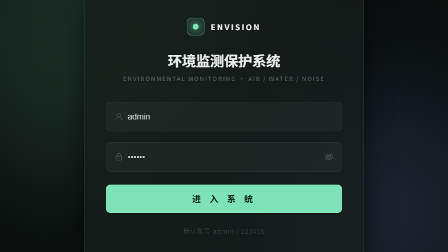
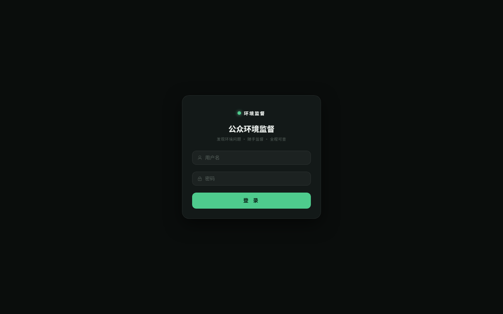
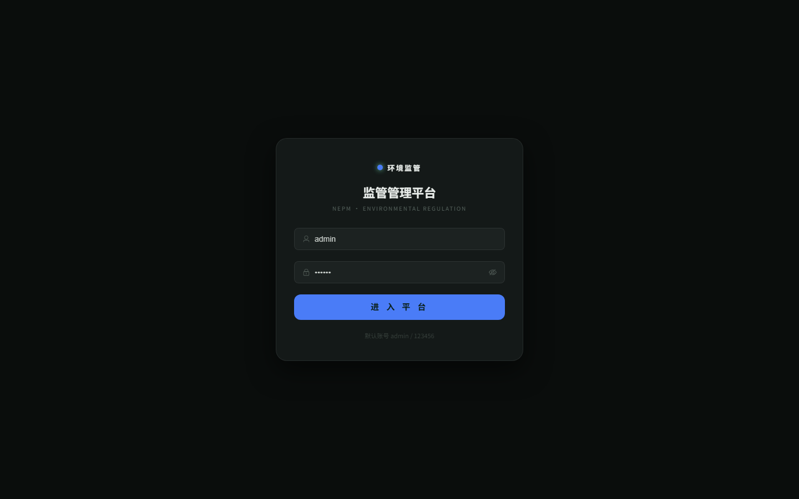
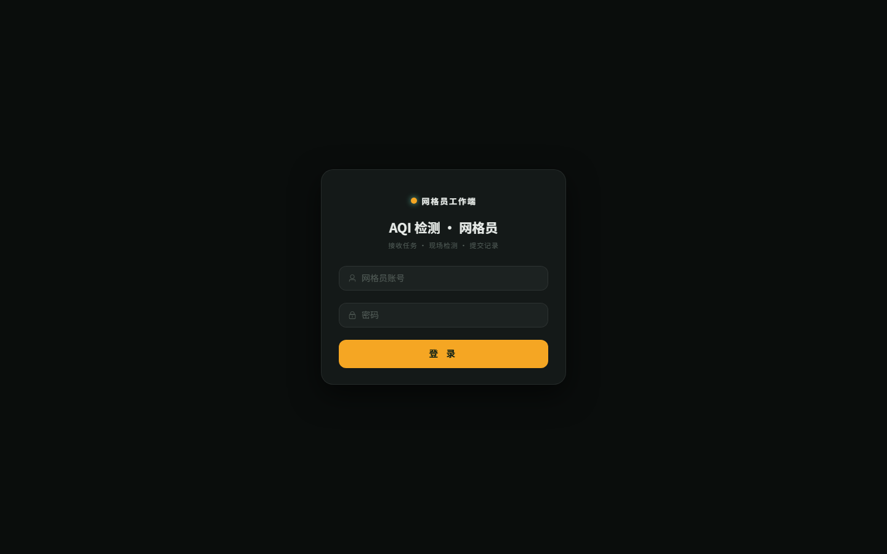
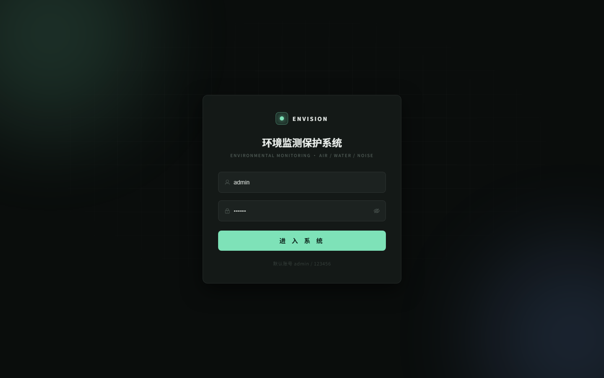
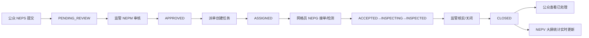

# 🌿 environmental-monitoring · 环境监测保护与公众监督系统

> 一套后端、一个数据库，驱动 **四端协同** 的完整环境治理闭环：从 **公众发现环境问题**，到 **网格员现场检测（自动计算 AQI）**，再到 **监管处置与决策可视化**。

     

---

## 📺 决策驾驶舱（NEPV）



---

## ✨ 特性亮点

- 🏙️ **四端一体的环境治理平台** —— 公众监督 / 监管处置 / 网格员检测 / 决策大屏，共享一套后端与数据库
- 📡 **真实监测闭环** —— 模拟器场景引擎（日周期/高峰/污染事件/离线/异常注入）或硬件上报 → 阈值告警 → WebSocket 实时推送
- 📋 **监督业务闭环** —— 提交 → 审核 → 派单 → 接单 → 现场检测（PM2.5/PM10/SO2/NO2/CO/O3 → **国标 AQI 自动计算**）→ 核实 → 关闭
- 🧬 **8 态状态机 + 全链路审计** —— 每次状态流转写入时间线（event_status_log），公众/监管/网格员全程可追溯
- 🔔 **定向实时通知** —— WebSocket 身份订阅：新监督通知管理员、派单通知网格员、关闭通知公众（通知只做提醒，数据以 REST+DB 为准）
- 🗺️ **空间态势与位置示意地图** —— NEPV 空间态势、NEPG 检测坐标地图
- 🛡️ **权限与安全** —— 数据级归属隔离（事件按人/任务按网格员）、登录令牌 24h 有效期校验、越权/状态注入防护（实测全拒）
- 🎨 **角色化视觉体系** —— 公众亲和绿 / 管理专业蓝 / 网格任务橙 / 驾驶舱深色绿，同一设计令牌基座差异化

## 📸 四端预览

| NEPS · 公众监督端 | NEPM · 监管端 | NEPG · 网格员端 | NEPV · 决策大屏 |
|:---:|:---:|:---:|:---:|
|  |  |  |  |
| 提交监督 · 我的事件 · 消息通知 | 工作台 · 审核派单 · 网格/任务管理 | 任务卡片 · 现场检测 · AQI | 实时大屏 · 空间态势 · 监管统计 |

## 🗺️ 系统架构

```text
┌────────────────────────────────────────────────────────────────┐
│ NEPS(5174)   NEPM(5175)   NEPG(5176)   NEPV(5173)             │
│  Vue 3 · Element Plus · ECharts（四端独立应用/差异化主题）       │
└──────────────┬───────────────────────────────┬────────────────┘
               │ HTTP /api                       │ WS /ws/notify
┌──────────────▼───────────────────────────────▼────────────────┐
│ Spring Boot 2.6.13 共享后端(:8080)                            │
│ ctrl → service → dao(MyBatis-Plus)                            │
│ 认证/事件状态机/任务/AQI引擎/通知/统计/上传                      │
└──────────────┬─────────────────────────────────────────────────┘
               │ JDBC
┌──────────────▼─────────────────────────────────────────────────┐
│ MySQL 8 · nep · 17 表 · 18 外键 · 最小增量迁移 v2-v6            │
└────────────────────────────────────────────────────────────────┘
```

## 🔄 业务闭环



每次状态变化都会写入审计时间线并向对应端推送实时通知。

## 🧩 技术栈

| 层 | 技术 |
|---|---|
| 后端 | Java 8 语法 · Spring Boot 2.6.13 · MyBatis-Plus 3.4.1 · Spring WebSocket · Maven |
| 前端 | Vue 3.5 · Vite 5 · Pinia · Vue Router · Element Plus · ECharts 5 · Sass |
| 数据 | MySQL 8（utf8mb4/InnoDB） |
| 运行 | JDK 21 · Node 18+ |

## 🚀 快速开始

### 1. 数据库（首次）
```bash
mysql -uroot -p < nepsystem/src/main/resources/db/init.sql
mysql -uroot -p < nepsystem/src/main/resources/db/migration_v2.sql
mysql -uroot -p < nepsystem/src/main/resources/db/migration_v3.sql
mysql -uroot -p < nepsystem/src/main/resources/db/migration_v4.sql
mysql -uroot -p < nepsystem/src/main/resources/db/migration_v5.sql
mysql -uroot -p < nepsystem/src/main/resources/db/migration_v6.sql
mysql -uroot -p < nepsystem/src/main/resources/db/demo_business_chain.sql  # 演示数据
```

### 2. 启动后端
```bash
cd nepsystem
mvn clean package -DskipTests
java -jar target/nepsystem-0.2.0.jar     # 默认开启模拟器(5s/轮)；纯业务演示可加 --simulator.enabled=false
```

### 3. 启动四个前端（各开一个终端）
```bash
cd nepsystem-web      && npm i && npm run dev   # NEPV :5173
cd nepsystem-web-neps && npm i && npm run dev   # NEPS :5174
cd nepsystem-web-nepm && npm i && npm run dev   # NEPM :5175
cd nepsystem-web-nepg && npm i && npm run dev   # NEPG :5176
```
> npm 安装慢可加镜像：`--registry=https://registry.npmmirror.com`

## 🔐 Demo 账号

| 端 | 地址 | 账号 | 密码 |
|---|---|---|---|
| NEPV 决策大屏 | http://localhost:5173 | admin | 123456 |
| NEPS 公众监督 | http://localhost:5174 | zhang_san（张三） | 123456 |
| NEPM 监管端 | http://localhost:5175 | admin | 123456 |
| NEPG 网格员端 | http://localhost:5176 | wang_qiang（王强） | 123456 |

> 🎬 **建议演示路线**：NEPS 张三提交一条监督 → NEPM 实时收到通知并审核/派单给王强 → NEPG 接单、录入六项污染物（AQI 自动计算）→ NEPM 核实并关闭 → NEPS 收到“已处理完成” → NEPV 大屏监管统计更新。

## 📚 文档

| 文档 | 说明 |
|---|---|
| [架构设计说明书](docs/01-项目架构设计说明书.md) | 总体/四端/前后端/数据库/API/WS/权限/部署 |
| [数据库设计说明书](docs/02-数据库设计说明书.md) | 17 表全字段/外键/ER 图 |
| [接口设计与接口文档](docs/03-接口设计与接口文档.md) | 80 端点 + 请求响应示例；[四端接口清单](docs/api) |
| [四端业务流程说明书](docs/04-四端业务流程说明书.md) | 闭环流程图/状态机 |
| [系统测试报告](docs/06-系统测试报告.md) / [Bug 跟踪报告](docs/07-Bug缺陷跟踪报告.md) | 76 用例与缺陷分级 |
| [部署与运行说明](docs/08-系统部署与运行说明.md) / [VSCode 启动指南](docs/VSCode启动指南.md) | 环境/启动/停止 |
| [API Contract Matrix](docs/test/API-Contract-Matrix.md) / [E2E-Test](docs/test/E2E-Test.md) | 契约与端到端验证 |

## ✅ 测试

- 后端：`mvn test` —— 76 用例全绿（业务/权限/越权/状态机/通知/统计/事务回滚）
- 前端：`npm run build` —— 四端构建通过

## 🏗️ 项目结构

```text
drenep/
├── nepsystem/                  # 共享后端（Spring Boot）
│   ├── src/main/java/org/nep/nepsystem/
│   │   ├── ctrl/ · service/ · dao/ · bean/ · dto/
│   │   ├── ws/（WebSocket 通知） · config/ · common/ · exception/
│   └── src/main/resources/db/   # init + migration_v2~v6 + demo
├── nepsystem-web/              # NEPV 决策大屏（Vue3）
├── nepsystem-web-neps/         # NEPS 公众监督端
├── nepsystem-web-nepm/         # NEPM 监管端
├── nepsystem-web-nepg/         # NEPG 网格员端
└── docs/                       # 架构/数据库/接口/测试等工程文档
```

## 📝 个人贡献

**【项目总负责人】**：项目总体架构与四端架构设计、前后端架构与接口契约、数据库设计（17 表建模与最小迁移）、NEPV 决策大屏开发、四端接口联调与闭环打通、系统测试与缺陷修复（76 项测试体系、P1-P2 缺陷清零）、最终验收与工程文档。

## 📄 许可

本项目用于课程设计与教学演示。演示数据与账号仅供学习交流。