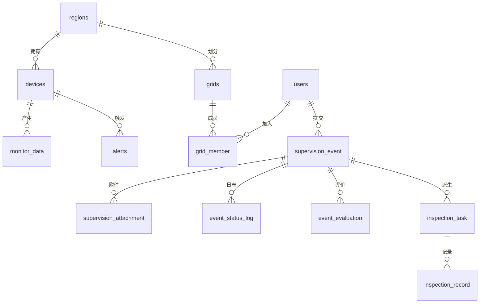

# 02 · 数据库设计说明书

> 库：`nep`（MySQL 8 · utf8mb4 · InnoDB）· 17 张表 · 18 个外键 · 74 个索引
> 本文档由 `information_schema` 实时导出生成，字段/类型/键均来自真实数据库。

## 1. 表清单与分类

| 分类 | 表 | 说明 |
|---|---|---|
| 认证 | admins / users | 管理员（登录）/ 用户（公众+网格员） |
| 基础 | regions / devices / sensors | 区域 / 监测设备 / 指标字典 |
| 监测 | monitor_data / alerts / thresholds / data_quality | 数据 / 告警 / 阈值 / 质量异常 |
| 监督业务 | supervision_event / supervision_attachment / event_status_log / event_evaluation | 事件 / 附件 / 状态日志 / 评价 |
| 网格任务 | grids / grid_member / inspection_task / inspection_record | 网格 / 成员 / 任务 / 检测记录 |

## 2. 认证类

### admins 管理员表
| 字段 | 类型 | 键 | 说明 |
|---|---|---|---|
| admin_id | int | PK 自增 | 管理员ID |
| admin_code | varchar(50) | UNI | 账号 |
| password | varchar(100) | | 密码（明文） |
| remarks | varchar(255) | | 备注 |
| create_time | datetime | | 创建时间 |

### users 用户表（公众+网格员共用）
| 字段 | 类型 | 键 | 说明 |
|---|---|---|---|
| id | int | PK 自增 | 用户ID |
| username | varchar(50) | UNI | 登录名 |
| password | varchar(100) | | 密码（明文） |
| nickname | varchar(50) | | 昵称 |
| role | varchar(20) | | USER/PUBLIC_SUPERVISOR/GRID_INSPECTOR（语义标记） |
| status | tinyint | | 1启用 0禁用 |
| create_time | datetime | | 创建时间 |

## 3. 基础类

### regions 区域表（1 条普通索引）
| 字段 | 类型 | 说明 |
|---|---|---|
| id | int PK 自增 | 区域ID |
| name | varchar(50) | 区域名称 |
| parent_id | int | 父区域（0=顶级） |
| description | varchar(255) | 描述 |

### devices 监测设备表（device_code UNI；type/region/lat 索引）
| 字段 | 类型 | 说明 |
|---|---|---|
| id | int PK 自增 | 设备ID |
| device_code | varchar(50) UNI | 设备编号（上报用） |
| device_name | varchar(100) | 名称 |
| type | varchar(20) | AIR/WATER/NOISE |
| region_id | int MUL | 所属区域（FK→regions.id） |
| location | varchar(255) | 位置描述 |
| lat/lng | decimal(10,7) | WGS84 坐标（v3 追加） |
| status | tinyint | 0离线 1在线 2停用 |
| last_report_time | datetime | 最近上报 |
| create_time | datetime | 创建 |

### sensors 指标字典表（sensor_code UNI）
| 字段 | 类型 | 说明 |
|---|---|---|
| id | int PK | 指标ID |
| sensor_code | varchar(30) UNI | TEMP/HUMI/PM25/CO2/PH/TURBIDITY/DO/NOISE |
| sensor_name / unit / device_type | varchar | 名称/单位/适用类型(NULL=通用) |
| min_range / max_range / standard_max | decimal(10,2) | 量程下限/上限/标准限值 |

## 4. 监测类

### monitor_data 监测数据表（核心，idx: device+time / sensor+time）
| 字段 | 类型 | 说明 |
|---|---|---|
| id | bigint PK 自增 | 数据ID |
| device_id | int NOT NULL MUL | 设备（逻辑关联 devices.id） |
| sensor_code | varchar(30) NOT NULL | 指标编码 |
| value | decimal(10,2) NOT NULL | 数值 |
| report_time | datetime NOT NULL | 上报时间 |
| create_time | datetime | 入库时间 |

### alerts 告警记录表（level/status/state/device_time 索引；id 雪花型 bigint）
| 字段 | 类型 | 说明 |
|---|---|---|
| id | bigint PK | 告警ID（字符串序列化防 JS 精度丢失） |
| device_id / sensor_code / level | | WARN/ALARM |
| state | varchar(20) | 生命周期：WARN/ALARM/ACKNOWLEDGED/PROCESSING/RESOLVED/NORMAL（v2） |
| alert_value / message | decimal/varchar | 触发值/描述 |
| status | tinyint | 0未处理 1已处理 |
| handle_user/handle_time/ack_time/ack_user/resolve_time/resolve_user/duration_seconds | | 流转审计（v2） |
| create_time | datetime | |

### thresholds 阈值表（device_id NULL=全局；device+sensor 索引）
| id int PK / device_id int MUL / sensor_code varchar / warn_min|max / alarm_min|max decimal / enabled tinyint / update_time | | |

### data_quality 质量异常表（UNI: device+sensor+issue_type）
| id bigint PK / device_id int / sensor_code varchar(30) / category varchar(20) QUALITY|ANOMALY / issue_type varchar(40) / severity varchar(10) / detail varchar(255) / latest_value decimal / first_seen|last_seen datetime / occurrence_count int | | |

## 5. 监督业务类

### supervision_event 监督事件表（核心；event_no UNI；status/user/device/region/assignee 索引）
| 字段 | 类型 | 说明 |
|---|---|---|
| id | bigint PK 自增 | 事件ID |
| event_no | varchar(50) UNI | 事件编号（EV+时间戳+随机，Demo 规范为 ENV-20260902-001） |
| user_id | int MUL FK→users.id | 提交人（NULL=匿名） |
| event_type | varchar(30) | POLLUTION/NOISE/DEVICE_FAULT/OTHER |
| title / description | varchar | 标题/描述 |
| device_id / region_id | int FK | 关联设备/区域（可空） |
| location / lat / lng | | 位置与坐标 |
| level | varchar(10) | WARN/ALARM |
| status | varchar(20) | 状态机 8 值（默认 PENDING_REVIEW） |
| assignee_id | int FK→users.id | 当前处理人 |
| create_time / update_time | datetime | |

### supervision_attachment 附件表（idx event；FK→supervision_event.id）
| id bigint PK / event_id bigint FK / file_name varchar(255) / file_path varchar(500) / file_size bigint / content_type varchar(100) / upload_user_id int / create_time | | |

### event_status_log 状态日志表（idx event/operator；FK→event/operator）
| id bigint PK / event_id bigint FK / from_status varchar(20) NULL / to_status varchar(20) NOT NULL / operator_id int FK（管理员操作置 NULL，账号记于 remark） / remark varchar(255) / create_time | | |

### event_evaluation 评价表（UNI event+user；FK→event/user）
| id bigint PK / event_id bigint FK / user_id int FK / score tinyint(1-5) / content varchar(500) / create_time | | |

## 6. 网格任务类

### grids 网格表（grid_code UNI；region/status 索引；FK→regions.id）
| id int PK / grid_code varchar(50) UNI / grid_name varchar(100) / region_id int FK / description varchar(255) / status tinyint(1启用0停用,v5) / create_time | | |

### grid_member 网格成员表（UNI grid+user；FK→grids/users）
| id int PK / grid_id int FK / user_id int FK / role varchar(20) GRID_USER|GRID_LEADER / status tinyint / create_time | | |

### inspection_task 巡检任务表（核心；task_no UNI；status/assignee/event/device/grid/priority 索引；FK→event/device/grid/assignee）
| 字段 | 类型 | 说明 |
|---|---|---|
| id | bigint PK | 任务ID |
| task_no | varchar(50) UNI | TK+时间戳（Demo 规范 TK-20260902-001） |
| event_id | bigint FK | 关联事件（NULL=独立巡检） |
| device_id / grid_id / assignee_id | FK | 设备/网格/执行网格员 |
| task_type | varchar(20) | INSPECTION/VERIFY |
| priority | varchar(10) | LOW/MEDIUM/HIGH（v5） |
| status | varchar(20) | 与事件状态机共用（默认 PENDING_REVIEW） |
| deadline / result | datetime/varchar | 截止/结论 |
| create_time / update_time | datetime | |

### inspection_record 巡检记录表（idx task/recorder；FK→task/recorder）
| 字段 | 类型 | 说明 |
|---|---|---|
| id | bigint PK | 记录ID |
| task_id | bigint FK | 所属任务 |
| record_type | varchar(20) | INSPECT/VERIFY |
| content | varchar(500) | 备注 |
| pm25/pm10/so2/no2/co/o3 | decimal(10,2) | 六项检测值（v6） |
| aqi_value | int | 计算 AQI（v6，HJ633-2012 分段） |
| lat/lng | decimal(10,7) | 检测坐标（v6） |
| images | varchar(1000) | 照片文件名（逗号分隔，登记式） |
| recorder_id | int FK→users.id | 记录人 |
| create_time | datetime | |

## 7. 外键清单（18）

grids.region_id→regions.id；grid_member.grid_id→grids.id / .user_id→users.id；
supervision_event.user_id→users.id / .device_id→devices.id / .region_id→regions.id / .assignee_id→users.id；
supervision_attachment.event_id→supervision_event.id；event_status_log.event_id→supervision_event.id / .operator_id→users.id；
event_evaluation.event_id→supervision_event.id / .user_id→users.id；
inspection_task.event_id→supervision_event.id / .device_id→devices.id / .grid_id→grids.id / .assignee_id→users.id；
inspection_record.task_id→inspection_task.id / .recorder_id→users.id。

## 8. ER 关系



## 9. 数据流

```text
模拟器/硬件 → monitor_data →（阈值引擎）→ alerts → WS data/alert → NEPV
NEPS 提交 → supervision_event → event_status_log（状态机全程审计）
管理员派单 → inspection_task(event_id 关联) → 网格员检测 → inspection_record(task_id 关联, 六项+AQI)
核实/关闭 → 事件+任务同步 CLOSED → NEPV 统计（4 业务表实时聚合）
```

## 10. 数据现状（演示库）

users 6（zhang_san/王强/网格员甲/乙/闭环市民/网格员）；事件 4（95 已巡检/205 已完成/360 ENV-20260902-001 已完成/401 进行中）；任务 4+2；检测记录若干；状态日志 40+；devices 5；grids 3；regions 6；monitor_data 3.9 万+。