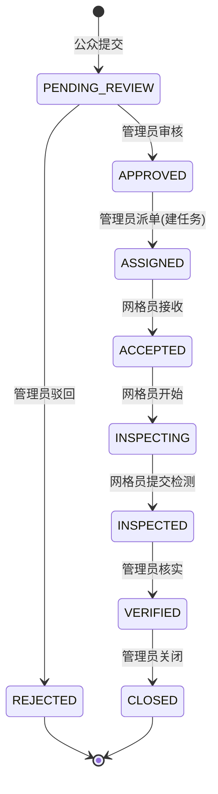

# 04 · 四端业务流程说明书

> 流程基于真实代码状态机与实测 E2E（15 步全通）绘制。

## 1. 总览

```mermaid
flowchart TD
    A[NEPS 公众登录] --> B[提交监督事件<br/>POST /api/supervision]
    B --> C[(supervision_event<br/>PENDING_REVIEW<br/>+event_status_log)]
    C --> D[WS 通知管理员<br/>SUPERVISION_CREATED]
    D --> E[NEPM 管理员审核<br/>PUT /supervision/{id}/approve]
    E --> F[(APPROVED)]
    E -.驳回.-> E2[(REJECTED)]
    F --> G[NEPM 派单<br/>PUT /supervision/{id}/assign]
    G --> H[(inspection_task 创建<br/>ASSIGNED<br/>event_id/assignee_id 关联)]
    G --> I[WS 通知网格员<br/>TASK_ASSIGNED]
    I --> J[NEPG 网格员接单<br/>PUT /tasks/mine/{id}/accept]
    J --> K[(ACCEPTED)]
    K --> L[NEPG 开始检测<br/>PUT /tasks/mine/{id}/start]
    L --> M[(INSPECTING)]
    M --> N[NEPG 现场检测<br/>六项+照片+坐标<br/>PUT /tasks/mine/{id}/submit]
    N --> O[(inspection_record<br/>AQI 计算<br/>任务/事件 INSPECTED)]
    O --> P[WS 通知管理员<br/>DETECT_SUBMITTED]
    P --> Q[NEPM 查看检测结果<br/>GET /tasks/{id}/records]
    Q --> R[NEPM 核实<br/>PUT /tasks/{id}/verify]
    R --> S[(VERIFIED)]
    S --> T[NEPM 关闭<br/>PUT /tasks/{id}/close]
    T --> U[(CLOSED<br/>事件/任务同步)]
    T --> V[WS 通知公众<br/>EVENT_CLOSED]
    V --> W[NEPS 查看处理结果<br/>GET /supervision/{id}<br/>8 条时间线/已完成]
    U --> X[NEPV 统计更新<br/>GET /stats/overview|supervision]
```

## 2. 状态机（事件=任务同步，8 态）



状态约束（Service 强制）：仅 PENDING_REVIEW 可审/驳；仅 APPROVED 可派；仅 ASSIGNED/ACCEPTED/INSPECTING/INSPECTED/VERIFIED 依次流转；乱序/重复一律 400；每次变化写 event_status_log（8 条审计时间线）；VERIFIED/CLOSED 仅管理员可达；前端不可传 status。

## 3. 各端业务细节

### NEPS（公众）
登录 → 首页（AQI/监测点/近期问题/我的监督数）→ 我要监督（类型/级别/标题/位置/描述/图片登记）→ 我的监督（待审核/处理中/已完成/已驳回分类）→ 详情（信息/图片/位置/状态徽章/时间线）→ 消息中心（事件动态 + EVENT_CLOSED 通知）。

### NEPM（管理员）
登录 → 工作台（今日监督/待审核/待派单/处理中/今日完成 + 待处理/最近任务/告警）→ 监督事件（列表筛选→详情含检测结果→审核/驳回/派单）→ 网格管理（CRUD/停用）→ 网格员管理（分配/完成率/查看任务）→ 任务管理（创建：网格+网格员+优先级+截止）。

### NEPG（网格员）
登录 → 我的任务（待接收/进行中/已完成/超时统计+任务卡）→ 任务详情（任务信息/公众反馈/位置地图/当前 AQI/历史 AQI）→ 接收→开始→现场检测（六项录入实时算 AQI、拍照登记、定位）→ 提交 → 历史任务。

### NEPV（决策驾驶舱）
登录 → Dashboard（Hero AQI + 实时仪表/曲线/空间分布/告警趋势 + 05 监管统计区块）→ 空间态势 → 历史/设备/告警/阈值/用户管理页（原有功能）。

## 4. 数据流完整性（实测）

| 环节 | 验证 |
|---|---|
| NEPS→NEPM | 提交后 NEPM admin/list 立即可查（eventNo 检索） |
| NEPM→NEPG | 派单后 NEPG mine 立即可见（assignee 本人） |
| NEPG→NEPM | 状态变化实时可见；records 可查检测结果（AQI=117 实测） |
| NEPM→NEPS | 关闭后公众详情 CLOSED + 8 条时间线 |
| 四端→NEPV | 统计 overview/supervision 随业务即时变化 |
| WS 通知 | 5 类事件定向推送（Phase 7 六项实测） |